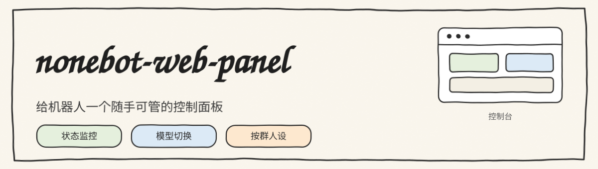

<div align="center">



[](https://www.python.org/)
[](https://fastapi.tiangolo.com/)
[](https://v2.nonebot.dev/)
[](./LICENSE)

一个嵌入 NoneBot 进程的 Web 控制面板：系统状态、模型切换、按群参与概率、按群人设，以及 QQ 登录与安全中心。

</div>

---

## 界面

<div align="center">

</div>

---

## 设计

面板是一个内嵌在 NoneBot 进程里的 FastAPI 应用。插件在 driver 启动时（`on_startup`）用 `uvicorn` 起一个 HTTP 服务，直接进程内访问 `chat_manager`，不经过外部 IPC。

```
浏览器  ──HTTP──►  FastAPI(uvicorn, 进程内)
                      │
                      ├─ 读/写  pxchat chat_manager（进程内对象）
                      └─ 代理 ► NapCat WebUI HTTP API（QQ 登录中心）
```

这样做的好处是：状态读取零序列化开销，修改即时生效；代价是面板与 Bot 同生共死，Bot 挂了面板也挂。

### 鉴权

所有 `/api/*` 接口都校验 token，取值顺序为：

```
?token=  →  x-token 请求头  →  panel_token Cookie
```

未通过校验返回 403。页面本身在通过校验后把 token 写入 Cookie，后续请求无需再带参数。

---

## 功能

| 模块 | 说明 |
|---|---|
| 系统状态 | 在线状态、所在群数、运行时长、系统负载与内存、当前模型 |
| 模型管理 | 查看/切换/新增/删除模型配置（对话与识图） |
| 参与概率 | 全局概率与每个群的独立概率 |
| 人设编辑 | 全局人设与每个群的独立人设，在线编辑保存 |
| 登录与安全中心 | 状态徽章、跳转 NapCat 登录页、代理拉取登录二维码 |

---

## 安装

```bash
pip install fastapi uvicorn httpx
```

把 `nonebot_plugin_web_panel` 放入插件目录，或在 `[tool.nonebot].plugins` 中登记。

### 配置

```dotenv
PANEL_TOKEN=change-me
PANEL_PASSWORD=123456
PANEL_PORT=6200
```

启动 NoneBot 后访问：

```
http://<host>:6200/?token=change-me
```

---

## API 参考

以下接口均需鉴权（`x-token` 或 `?token=`）。

| 方法 | 路径 | 请求体 | 说明 |
|---|---|---|---|
| GET | `/api/state` | - | 聚合状态：在线、模型、概率、人设、统计 |
| POST | `/api/model` | `{"name": "..."}` | 切换当前对话模型 |
| POST | `/api/model/add` | `{name,api_key,api_url,model}` | 新增模型配置 |
| POST | `/api/model/del` | `{"name": "..."}` | 删除模型配置 |
| POST | `/api/group` | `{group_id,action}` | 启用/禁用某个群 |
| POST | `/api/prob` | `{"value": 0.0~1.0}` | 设置全局参与概率 |
| POST | `/api/group_prob` | `{group_id,value}` | 设置按群参与概率，`value=default` 清除 |
| POST | `/api/personality` | `{"personality": "..."}` | 设置全局人设 |
| POST | `/api/group_personality` | `{group_id,personality}` | 设置按群人设 |
| POST | `/api/login_qrcode` | - | 代理 NapCat，返回最新登录二维码 |

`/api/login_qrcode` 的工作方式是：用 `SHA256(token + ".napcat")` 登录 NapCat WebUI 换取 `Credential`，再以 Bearer 调用其 `QQLogin` 接口。相关实现见 [`napcat-webui-api`](https://github.com/)。

---

## 安全说明

- token 通过 URL 参数传入时可能出现在访问日志中，生产环境建议改用请求头或反代注入。
- 面板默认监听 `0.0.0.0`，请通过防火墙或 Nginx 反代限制来源。
- 面板能修改模型密钥与机器人行为，等同于管理员权限，务必设置强 token。

---

## 兼容性

| 依赖 | 版本 |
|---|---|
| Python | 3.10+ |
| FastAPI / uvicorn | 0.11x / 0.30+ |
| nonebot-plugin-pxchat | 读取其 `chat_manager` 接口 |

按群概率、按群人设依赖 pxchat 侧存在对应方法；未打补丁时相关接口会返回不支持。

## License

[MIT](./LICENSE)
